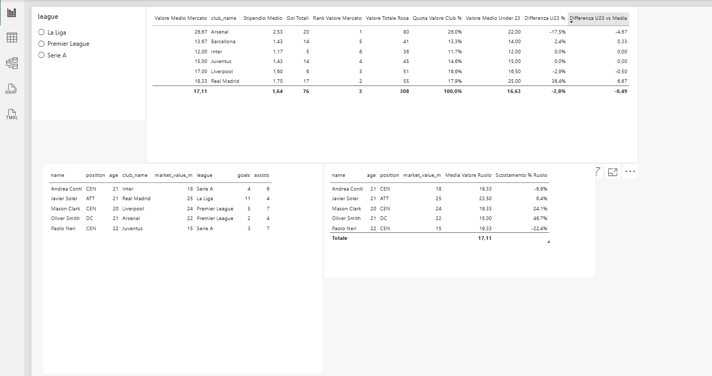
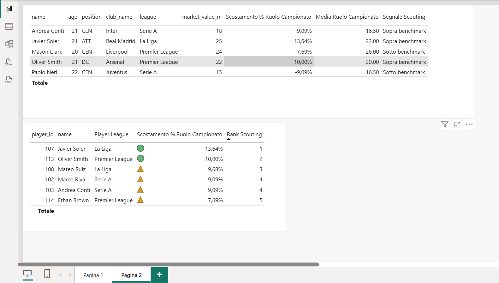

# Football Scouting & Market Value Analysis — Power BI

A Power BI portfolio project designed to support football scouting decisions through player, club, market-value and performance analysis.

## Project goal

The report explores how player profiles can be compared against club- and league-level benchmarks to surface potentially interesting scouting targets.

Rather than presenting raw statistics only, the dashboard combines player attributes with calculated scouting indicators, rankings and contextual benchmarks.

## What the report analyzes

The Power BI model is built around two main entities:

- `PlayersTable`
- `ClubsTable`

The report includes analysis of:

- player age and position
- club and league
- player market value
- goals and assists
- average salary
- total squad value
- club market-value ranking
- club share of market value
- average value of Under-23 players
- player value versus positional benchmarks
- player value versus league-and-position benchmarks
- scouting signals and scouting ranking

## Scouting logic

The report goes beyond descriptive reporting by comparing player market values with contextual benchmarks.

Examples of measures used in the model include:

- `Media Valore Ruolo`
- `Scostamento % Ruolo`
- `Media Ruolo Campionato`
- `Scostamento % Ruolo Campionato`
- `Segnale Scouting`
- `Rank Scouting`
- `Valore Medio Under 23`
- `Differenza U23 %`
- `Differenza U23 vs Media`

This creates a simple decision-support layer for identifying profiles that may deserve further scouting attention.

## Report structure

### Page 1 — Market and player analysis

Focuses on club and player-level market context, including:

- club market-value metrics
- total squad value
- average salary
- goals
- Under-23 market-value indicators
- player age, position, club, league, market value, goals and assists
- positional market-value comparisons
- league filtering

### Page 2 — Scouting shortlist

Focuses on potential scouting candidates using:

- player and club information
- league and positional context
- market-value deviation versus league/position benchmarks
- scouting signal
- scouting ranking

The report also contains conditional formatting to make scouting signals easier to interpret.

## Tools and skills demonstrated

- Microsoft Power BI
- Data modelling
- DAX measures and visual calculations
- KPI design
- Data filtering and segmentation
- Benchmark analysis
- Dashboard design
- Business-oriented data interpretation
- Football / recruitment analytics
- Communicating analytical findings to non-technical users

## Repository structure

```text
football-scouting-powerbi/
├── README.md
├── powerbi/
│   └── footballscouting.pbix
├── docs/
│   └── model-overview.md
└── screenshots/
    └── README.md
```

## Open the report

Download `powerbi/footballscouting.pbix` and open it with Microsoft Power BI Desktop.

## Dashboard preview

### Market and player analysis



This page provides a high-level view of club and player market data, including squad value, average market value, goals, Under-23 indicators and positional benchmarks.

### Scouting shortlist



This page turns the benchmark logic into a scouting-oriented shortlist by comparing each player with the average market value for the same role and league, then surfacing a scouting signal and rank.

## Why I built it

I am developing a portfolio at the intersection of **data analysis, business decision-making and football scouting**. This project is an example of turning football data into a practical decision-support report rather than stopping at raw statistics.

## Next improvements

Planned extensions include:

- cleaner visual storytelling and page titles
- additional player-performance metrics
- richer league and positional benchmarking
- documented data sources and refresh workflow
- Python/SQL preprocessing where useful
- automated data ingestion through APIs
- clearer explanation of the scouting score methodology

---

**Portfolio project — Power BI / Data Analytics / Football Analytics**
